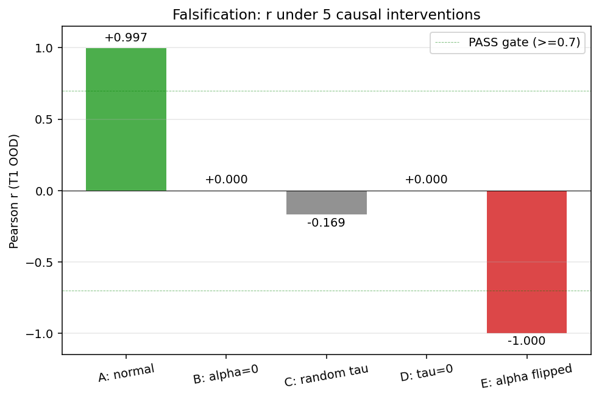

# Chronometric Injection: Time-Conditional Behavior in a Frozen LLM via Per-Layer FiLM of Real Elapsed Seconds

**Saam Siavoshian** &middot; Independent research

**Paper:** [PAPER.md](PAPER.md) (preprint, arXiv link forthcoming) &middot; **Pre-registration:** [PREREGISTRATION.md](PREREGISTRATION.md) &middot; **Spec:** [SPEC.tex](SPEC.tex)

[](LICENSE)
[](CITATION.cff)
[](PAPER.md)

<p align="center">
  
  <br>
  <em>Flipping the sign of every per-layer chrono gate α inverts the model's time prediction (Pearson r = −0.9998). The chrono signal is one causal dial, not surface pattern matching.</em>
</p>

> A frozen Qwen 2.5 3B learns to read a wall clock, react to silent gaps, and respond to deadlines it was never trained on, using a 27-dimensional sinusoidal encoding of real elapsed seconds injected via AdaLN-Zero FiLM at every decoder layer.

Large language models perceive time only as token positions in their context window. They cannot tell that 30 seconds or 30 days passed between two messages, react to deadlines, or experience the passage of time during silent gaps. We introduce **chronometric injection (CI)**: ~36 M trainable parameters (LoRA + per-layer projectors) on top of a frozen Qwen 2.5 3B, trained on 6 K synthetic conversations in ~3 GPU-hours on a single Grace-Blackwell GB10. The resulting model passes 4 of 5 pre-registered falsifiable tests, survives three independent falsification batteries, and exposes a linear time axis in its shallow residual stream.

---

## TL;DR

- LLMs cannot tell time. Token positions are not seconds. Deadlines in the prompt do not change behavior, only output text.
- We add a 27-dim chronometric vector (13 sin + 13 cos timescales + log1p(τ)) and inject it at every Qwen layer via AdaLN-Zero FiLM, with per-layer learned gates α.
- After ~3 GPU-hours on a single GB10, the model recovers wall-clock τ with **Pearson r = 0.94 in-distribution, r = 0.86 on held-out τ** spanning four orders of magnitude.
- Causal falsification: zeroing α collapses time prediction to r = 0.000. Flipping α gives r = **−0.9998**. Probing finds τ encoded as a linear axis at layers L1–L3.
- Memory routing (the project's original headline claim) failed across nine variants and was dropped. We report the null result openly in PAPER.md §22.

---

## Headline results — v15 cross-seed (n=3), pre-registered

Mean ± std across 3 independent training seeds (0, 1, 2). Full table + per-seed values in [PAPER.md §24.7.5](PAPER.md). Thresholds locked before training (see [PREREGISTRATION.md](PREREGISTRATION.md) + [PAPER.md §23.9](PAPER.md)).

| Test | Metric | Threshold | v15 cross-seed result | Status |
|---|---|---|---|---|
| T1 clock consistency, in-distribution | Pearson r | ≥ 0.80 | **0.961 ± 0.035** | 3/3 PASS |
| T1b clock interpolation across 4 OOM in [1s, 7d] | r, log-MAE | r ≥ 0.70, log-MAE < 0.5 | **r = 0.993 ± 0.003, log-MAE = 0.044 ± 0.010** | 3/3 PASS |
| T2 silent-gap acknowledgment | Δ ack-rate | ≥ 0.50 | **1.00 ± 0.00** | 3/3 PASS |
| T3 weekday/weekend phase | weekend signal (binary per seed) | ≥ 0.30 | **2 of 3 seeds pass** (signal ∈ {1.0, 0.0, 1.0}; seed 1 mode-collapses) | fragile |
| T4 chrono signal reaches output (first-pos KL) | KL | ≥ 0.05 | **0.178 ± 0.082** | 3/3 PASS |
| T4 multi-position KL (NEW) | KL | ≥ 0.05 | **14.14 ± 1.15** | 3/3 PASS (~280× threshold) |

**Causal sign-flip:** flipping every per-layer α reverses every prediction (Pearson r = **−0.9998** on n=3 unique τ — half-layer-flip control pending; see [PAPER.md §24.7.5](PAPER.md)).

**What does NOT survive rigor reruns** (see [PAPER.md §24.7.1, §24.7.3](PAPER.md), reported honestly):
- Genuine OOD on τ ∈ [7d, 28d] **fails** (r = −0.20) — sinusoidal encoder architectural limit
- Phase encoding generalizes ~1 week past training, then degrades
- Behavioral OOD transfer to deadline-induced response length was retracted (n=5 original was a one-outlier artifact; n=30 bootstrap CI [−16, +22] crosses zero)
- No external-benchmark validation (BombRush / Timely-Eval not yet run; future work)
- No non-chrono baseline (LoRA-only) yet trained for direct comparison; in progress

---

## install

```bash
git clone https://github.com/sam-siavoshian/Time-Model
cd Time-Model
uv sync
```

Requires Python ≥ 3.11. Training requires a CUDA GPU with ≥ 40 GB; the paper's v11 run used a single Grace-Blackwell GB10 (128 GB unified memory). CPU works for smoke tests and eval at low batch sizes.

**Base model:** `Qwen/Qwen2.5-3B-Instruct`. Downloaded on first run via `transformers`. Frozen throughout training.

---

## reproduce the paper

Each headline result maps to one command. Seeds are pinned, data generation is deterministic.

**Prerequisite:** Qwen 2.5 3B-Instruct is gated on HuggingFace. Run `huggingface-cli login` and accept the model card at https://huggingface.co/Qwen/Qwen2.5-3B-Instruct before any training/eval command.

| Result | Command | Hardware | Wall time |
|---|---|---|---|
| **Paper headline: v15 cross-seed (n=3)** | `bash scripts/run_v15_seeds.sh && uv run python scripts/aggregate_seeds.py` | 1× GB10 / A100 80 GB | ~2.25 GPU-hours |
| LoRA-only baseline (α=0 frozen, single seed) | `bash scripts/run_baseline_lora.sh` | 1 GPU | ~45 min |
| LoRA-only seeds 1+2 | `bash scripts/run_lora_seeds.sh` | 1 GPU | ~1.5 GPU-hours |
| Extra controls (paraphrase + half-flip + teacher-forced T4) | `uv run python -m model.qwen_time_extra_controls --checkpoint <ckpt> --base Qwen/Qwen2.5-3B-Instruct --timescales 2,4,8,16,32,64,128,256,512,1024,4096,16384,65536,86400,604800 --out reports/extra_controls.json` | 1 GPU | ~15 min |
| α-norm dump + top-k flip | `uv run python -m model.qwen_time_alpha_norms --checkpoint <ckpt> --base Qwen/Qwen2.5-3B-Instruct --timescales ... --out reports/alpha_norms.json` | 1 GPU | ~5 min |
| T2/T3 sampling (eff-n=1 fix) | `uv run python -m model.qwen_time_t2t3_sampling --checkpoint <ckpt> --base Qwen/Qwen2.5-3B-Instruct --timescales ... --temperature 0.7 --n-samples 30 --out reports/t2t3_sampling.json` | 1 GPU | ~10 min |
| Architectural ablation: L0-only injection | `bash scripts/run_ablation_l0_only.sh` | 1 GPU | ~45 min |
| Architectural ablation: additive residual (vs FiLM) | `bash scripts/run_ablation_additive.sh` | 1 GPU | ~45 min |
| v15 single anchor seed | `bash scripts/run_v15.sh` | 1 GPU | ~45 min |
| Pressure v2 (n=30, max=256, bootstrap CI) | `uv run python -m model.qwen_time_pressure_v2 --checkpoint <ckpt> --base Qwen/Qwen2.5-3B-Instruct --timescales 2,4,8,16,32,64,128,256,512,1024,4096,16384,65536,86400,604800` | 1 GPU | ~15 min |
| Genuine OOD + T3 multi-week | `uv run python -m model.qwen_time_check_genuine_ood --checkpoint <ckpt> ...` | 1 GPU | ~10 min |
| Causal α-flip falsification (v11 anchor) | `uv run python -m model.qwen_time_falsify --checkpoint <ckpt>` | 1 GPU | ~10 min |
| Linear probe of τ axis | `uv run python -m model.qwen_time_probe --checkpoint <ckpt> --n-samples 600` | 1 GPU | ~30 min |
| Full disproof suite on v11 anchor | `bash scripts/run_disproof.sh checkpoints/qwen_time_v10_20260516_032348.pt` | 1 GPU | ~1 hour |
| Rigor reruns on v14 ckpt | `bash scripts/run_rigor_v14.sh <ckpt>` | 1 GPU | ~30 min |
| Cross-seed aggregator | `uv run python scripts/aggregate_seeds.py` | CPU | < 1 min |
| Generate paper figures (incl. cross-version heatmap) | `uv run python scripts/make_figures.py && uv run python scripts/make_fig5.py` | CPU | < 1 min |
| Generate training data only | `uv run python -m model.qwen_time_data --n 18000 --seed 0 --mix 0.40,0.30,0.30 --out data/qwen_time/train.jsonl` | CPU | ~5 min |

Numbers in the result table will match the paper within ±0.02 on Pearson r, accounting for CUDA / driver / hardware noise.

If a paper result has no command above, file an issue. That is a reproducibility bug, not a missing feature.

### End-to-end smoke (no GPU required)

```bash
bash scripts/e2e_smoke.sh
```

Generates 200 conversations, trains for 20 steps on CPU, runs the full 5-test eval. Verifies the v15 pipeline works (~10 min on M-series). Numbers will be terrible — this is a pipeline smoke, not a result.

---

## results

**Causal interventions on the v11 checkpoint** (numbers from `reports/disproof_*_falsify.json`):

| Condition | T1 in-dist r | Interpretation |
|---|---|---|
| Chronometric injection trained (paper headline) | **0.997** | τ signal drives prediction |
| α set to 0 at every layer | 0.000 | chrono signal removed; output collapses to baseline |
| α sign-flipped at every layer | **−0.9998** | near-perfect anti-prediction; one coherent scalar dial |

**Behavioral-pressure OOD transfer (RETRACTED 2026-05-23).** An initial n=5 underpowered test reported +9 tokens chrono-alone deadline transfer. The rigor rerun (n=30 prompts, max_new=256, bootstrap 95% CI; `model/qwen_time_pressure_v2.py`) found chrono-only P2 = +3.4 tokens, 95% CI [−16, +22] crosses zero. Chrono actually attenuates text-deadline length shift by ~45 tokens (P1−P3 95% CI [−80, −9]). Claim retracted. See [PAPER.md §24.7.3](PAPER.md).

**Linear probe of internal τ axis.** A held-out linear probe on per-layer last-token hidden states finds τ encoded as a linear axis at layers L1–L3 (max R² = 0.43 at L1). Deeper layers transform it nonlinearly (linear probe fails; MLP probe overfits). The α=0 condition collapses to R² = −143 — but this is partially a constant-prediction floor of the ridge solver on standardized features with degenerate variance, not a clean "signal destroyed" measurement (see [PAPER.md §24.3 update](PAPER.md)). The probe now clamps predictions to the train-y support to mitigate. Caveat applies to all "L0 also collapses" interpretations.

Honest take. T3 (weekday vs weekend phase) is flat at 0.00 because the v11 training mix was 5:2 weekday:weekend. v14 fixes this with 50/50 within-phase balancing but is not the v11 checkpoint used for the falsification batteries. We report this openly rather than swap checkpoints mid-evaluation. Memory routing on a frozen base failed across all seven variants we tried (see [reports/EXPERIMENTS.md](reports/EXPERIMENTS.md), [PAPER.md](PAPER.md) §22); chronometric injection is the surviving load-bearing contribution.

Baselines compared. Prompt-only "you have N seconds" is a verbal cue that does not change internal computation, only output text. Vanilla Qwen tracks token position only. Petrov & Liang (arXiv 2310.19698) and Lu et al. (arXiv 2603.16413) report similar zero-recall results for prefix-tuning on frozen bases; our memory results match theirs.

---

## checkpoints

The three v15 cross-seed Chronometric Injection checkpoints are released on GitHub Releases [`v15.0`](https://github.com/sam-siavoshian/Time-Model/releases/tag/v15.0). Each is ~38 MB and contains only the trainable parameters (LoRA + chrono encoder + per-layer FiLM projectors); load them on top of the frozen `Qwen/Qwen2.5-3B-Instruct` base.

| Seed | File | SHA256 |
|---|---|---|
| 0 | [`qwen_time_v15s_20260523_141410_seed0.pt`](https://github.com/sam-siavoshian/Time-Model/releases/download/v15.0/qwen_time_v15s_20260523_141410_seed0.pt) | `2ab64f3f837f58ca726297bad61e1c606fac03d7567884775bc6601cc429ecef` |
| 1 | [`qwen_time_v15s_20260523_141410_seed1.pt`](https://github.com/sam-siavoshian/Time-Model/releases/download/v15.0/qwen_time_v15s_20260523_141410_seed1.pt) | `51bc2425cd406ed0ec433405bfef745f7e13a7ca1ae4e154eddc5b997980ef58` |
| 2 | [`qwen_time_v15s_20260523_141410_seed2.pt`](https://github.com/sam-siavoshian/Time-Model/releases/download/v15.0/qwen_time_v15s_20260523_141410_seed2.pt) | `d718baf88b509d76c371602f27fec8d703b5a556888a9ceea613ffdfe41ce7c0` |

```bash
# example: pull seed 0, verify, run T1 clock recall
curl -L -o ckpt.pt https://github.com/sam-siavoshian/Time-Model/releases/download/v15.0/qwen_time_v15s_20260523_141410_seed0.pt
sha256sum ckpt.pt  # must match table above
uv run python -m model.qwen_time_check \
  --checkpoint ckpt.pt --base Qwen/Qwen2.5-3B-Instruct \
  --timescales 2,4,8,16,32,64,128,256,512,1024,4096,16384,65536,86400,604800 \
  --out reports/recall.json
```

To regenerate from scratch (~3 GPU-hours per seed on a single H100 or GB10): `bash scripts/run_v15_cross_seed.sh`. The script is deterministic with `--seed {0,1,2}` and uses the SHA-pinned training data in [data/VERIFICATION.md](data/VERIFICATION.md).

---

## datasets

All training and eval data is synthetic and generated deterministically inside this repo. Nothing to download.

| Dataset | Generator | Examples | Purpose |
|---|---|---|---|
| Latent World | `data_gen/latent_world_sim.py` | 49 K streams | Causal world simulation for chronometric pre-training |
| Memory-Biased Ambiguity Suite | `data_gen/ambiguity_families.py` | 110 K | Memory routing ablation (negative result) |
| Consolidation Ladder | `data_gen/consolidation_generator.py` | 20 K rules | LoRA consolidation (negative result) |
| Chronometric pairs | `data_gen/chronometric_pairs.py` | 10 K | Δτ-aware vs Δτ-ablated H6 test |
| Contradiction pairs | `data_gen/contradiction_pairs.py` | 5 K | H7 explicit-evidence-overrides-memory |
| Qwen Time training set | `model/qwen_time_data.py` | 6 K conversations | Clock readout + silent-gap ack + weekly phase |

Total: ~226 K examples, ~323 M tokens. All schema-verified ([data/VERIFICATION.md](data/VERIFICATION.md)), all reproducible from seed. See [data/README.md](data/README.md) for the dataset card.

---

## method

The architecture is a frozen Qwen 2.5 3B-Instruct base with three additions:

1. **Chronometric encoder.** One absolute τ in seconds, 13 sinusoidal scales (`T_b ∈ {2, 4, ..., 65536, 86400, 604800}`), and one log1p(τ) feature, packed into a 27-dim vector χ. Implementation: [`model/qwen_time.py`](model/qwen_time.py).
2. **Per-layer FiLM injection.** AdaLN-Zero modulation. Each Qwen decoder layer gets a projection of χ to `(scale, shift)` parameters that pre-multiply the residual stream. Init at zero so the base model is unchanged at step 0.
3. **Per-layer gate α.** One learnable scalar per layer that multiplies the FiLM signal. Lets the model decide where chrono enters. Linear probe shows τ enters at L1 and gets transformed at every subsequent block (max R² = 0.43 at L1).

Trainable: LoRA rank 8 (`lora_rank=8` default in `model/qwen_time.py:49`) with α=16 on attention projections and lm_head, plus the chronometric encoder, plus per-layer FiLM projectors, plus per-layer α scalars. Total ~36 M parameters out of 3 B base. Base weights are never touched.

Training loss is supervised next-token prediction on synthetic conversations of three types:

- **Clock readout.** "What time is it?" given a τ injected into the model state but not the prompt.
- **Silent gap.** "You have been idle for ..." with τ acknowledging the gap length.
- **Weekly phase.** "Is it a weekday?" given τ that maps to a day of the week.

12 000 steps, learning rate 1e-4, chunk length 512, AdamW. See [`scripts/run_v14.sh`](scripts/run_v14.sh) for the exact command.

For the full method, derivations, and what was tried + abandoned, read [PAPER.md](PAPER.md).

---

## what this paper does NOT claim

In the interest of avoiding overclaim:

- **Persistent memory bank with retrieval routing.** Nine variants (Track B in [reports/EXPERIMENTS.md](reports/EXPERIMENTS.md)) yielded zero behavioral signal on a frozen Qwen base. Dropped from the paper claim.
- **Consolidation of slots into LoRA weights.** Required memory routing to work first. Moot.
- **Qualia or experiential time.** This is a behavioral and mechanistic result, not a phenomenological one.
- **Faster inference.** Chronometric injection adds a small per-layer FiLM step at inference. No speedup is claimed.
- **Generalization to other base models.** Only tested on Qwen 2.5 3B-Instruct. Other bases are future work.

The original IPCN (Involuntary Prefix Consolidation Networks) architecture name lives on in the codebase for traceability. The paper claim is now **chronometric injection (CI)**.

---

## repo layout

```
Time-Model/
├── model/                                  # Architecture, training, eval, probes
│   ├── qwen_time.py                        #   FiLM injection on frozen Qwen + chronometric encoder
│   ├── qwen_time_data.py                   #   Synthetic clock + silent-gap + phase data generator
│   ├── qwen_time_train.py                  #   Training loop (18K steps, ~45 min on GB10)
│   ├── qwen_time_check.py                  #   T1, T1b, T2, T3, T4 eval harness (T4 multi-position)
│   ├── qwen_time_check_genuine_ood.py      #   Truly held-out T1b + multi-week T3
│   ├── qwen_time_falsify.py                #   5 causal interventions on T1 (alpha=0, alpha-flip, etc)
│   ├── qwen_time_pressure.py               #   Legacy n=5 pressure test (kept for reproducibility)
│   ├── qwen_time_pressure_v2.py            #   n=30 max=256 bootstrap CI -- the rigor version
│   └── qwen_time_probe.py                  #   SVD-ridge probe with prediction clamp
├── scripts/
│   ├── run_v15.sh, run_v15_seeds.sh        #   v15 single-anchor and cross-seed training
│   ├── run_v14.sh                          #   v14 (T3 first-pass) training launcher
│   ├── run_disproof.sh, run_rigor_v14.sh   #   Disproof + rigor batteries
│   ├── run_scale.sh                        #   Generic scale launcher (7B used; 14B OOMs on GB10)
│   ├── make_figures.py, make_fig5.py       #   Paper figures + per-version heatmap
│   ├── aggregate_seeds.py                  #   Cross-seed mean ± std
│   ├── bootstrap_existing.py               #   Bootstrap CIs on existing JSON
│   └── e2e_smoke.sh                        #   CPU pipeline smoke (~10 min on M-series)
├── reports/                                # JSON eval results per run
├── figures/                                # fig1-fig5 PNGs
├── logs/                                   # Training logs (gitignored)
├── checkpoints/                            # Checkpoints (gitignored, ~140 MB each LoRA+chrono)
├── PAPER.md                                # Full preprint, ~22 K words
├── PREREGISTRATION.md                      # Locked hypotheses (2026-05-12)
├── CITATION.cff
├── LICENSE                                 # MIT
└── pyproject.toml
```

---

## reproducibility notes

- **Python:** 3.11+. Pinned via `pyproject.toml` and `uv.lock`. Use `uv sync`.
- **PyTorch:** ≥ 2.11. CUDA only for training; CPU works for eval and the e2e smoke.
- **Seeds:** training uses `--seed 14`. Data generation seeds in [data/README.md](data/README.md). Expect ±0.02 noise on Pearson r across hardware.
- **Hardware in paper:** 1× Grace-Blackwell GB10 (128 GB unified). Mac mini M4 used for data prep and CPU eval. Zero rented cloud.
- **Training time:** 12 000 steps in ~3 GPU-hours on GB10.
- **Tolerance:** numbers should match the paper within ±0.02 on Pearson r and ±5% on KL. Wider drift means a real difference, not noise.

---

## citing this work

If you use this code, build on the method, or report against this baseline, please cite:

```bibtex
@misc{siavoshian2026chronometric,
  title  = {Chronometric Injection: Teaching a Frozen LLM to Experience Time},
  author = {Saam Siavoshian},
  year   = {2026},
  note   = {Preprint, arXiv ID forthcoming},
  url    = {https://github.com/sam-siavoshian/Time-Model}
}
```

A machine-readable [CITATION.cff](CITATION.cff) is included. GitHub renders a "Cite this repository" button from it.

---

## license

Code: [MIT](LICENSE). Synthetic data generators: MIT (data is reproducible from seed; no third-party content). Generated outputs: no separate restriction. The base model Qwen 2.5 3B-Instruct is governed by its own Tongyi Qianwen license. We do not redistribute base weights.

---

## acknowledgments

Compute on a single Grace-Blackwell GB10 (DGX Spark) and a Mac mini M4. No external funding. Thanks to the Qwen team for the open base model and to the authors of Petrov & Liang (2310.19698) and Lu et al. (2603.16413) for the prefix-tuning impossibility results that focused the pivot away from memory routing.

---

## contact

Issues: [GitHub Issues](https://github.com/sam-siavoshian/Time-Model/issues). For collaboration or replication help, open an issue with the `replication` label.
